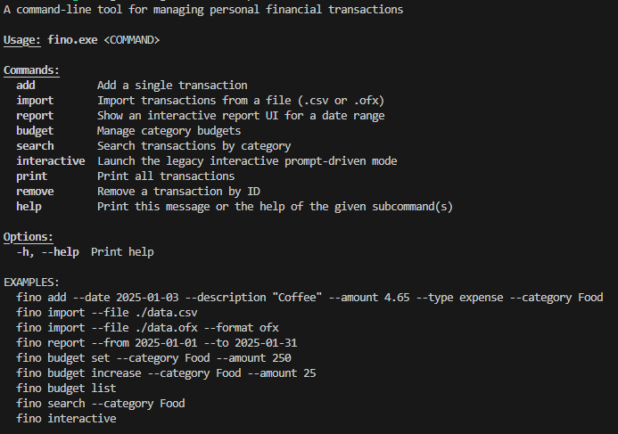
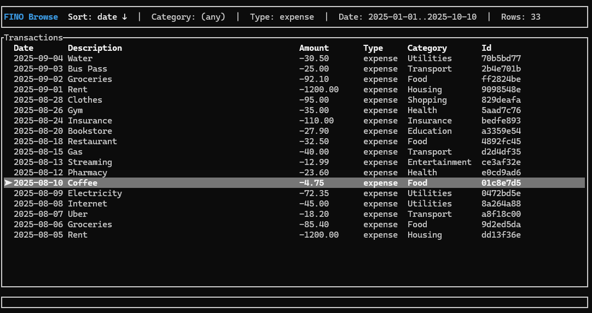
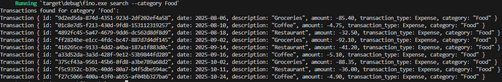
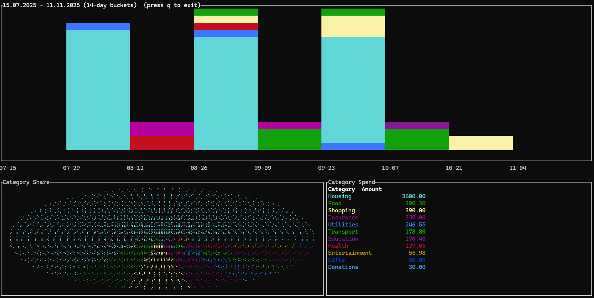

<p align="center">
  
</p>

<p align="center">
  
</p>

# Fino

Fino is a local-first command-line app for tracking transactions (income/expense), importing bank exports, and exploring spending in the terminal.

It stores everything in a single SQLite file created in the working directory: `financial_app.db`.

More detail:
- Architecture: `docs/ARHITECTURE.md`
- Decisions: `docs/DECISION.md`

---

## Features

- Add/Remove/Search/Print transactions (UUID-backed)
- Import `.csv` and `.ofx`
- Optional categorization via regex rules (applied on import when category is missing/`Uncategorized`)
- Category budgets + budget-exceeded alerts
- Terminal UIs: `report` (charts) and `browse` (viewer)

## Docs

- `docs/ARHITECTURE.md` (how the system works)
- `docs/DECISION.md` (why key choices were made)

## Usage

```bash
cargo run -- --help
cargo run -- <command> [options]
```

Common commands:

```bash
fino add --date 2025-01-03 --description "Coffee" --amount 4.65 --type expense --category Food
fino import --file ./test/data.csv
fino import --file ./my_export.ofx --format ofx
fino budget set --category Food --amount 250
fino search --category Food
fino report --from 2025-01-01 --to 2025-01-31
fino browse   # alias: fino tui
```

## Examples (with output)

### Browse

<p align="center">
  
</p>

### Add transaction

```bash
fino add --date 2025-01-03 --description "Coffee" --amount 4.65 --type expense --category Food
```

```text
Transaction added successfully. ID: 550e8400-e29b-41d4-a716-446655440000
```

### Import (CSV)

```bash
fino import --file ./test/data.csv
```

```text
Successfully imported 45 transactions.
```

CSV format (no header, 5 columns):

```csv
YYYY-MM-DD,Description,Amount,income|expense,Category
```

### Import (OFX)

```bash
fino import --file ./my_export.ofx --format ofx
```

```text
Successfully imported 12 transactions.
```

### Search
<p align="center">
  
</p>

### Categorization behavior

- If the imported category is empty, it becomes `Uncategorized`.
- If category is `Uncategorized`/empty/`null`, Fino applies the first matching regex rule based on the transaction description.
- If no rule matches, the transaction stays `Uncategorized`.

Rules are currently managed via the legacy interactive mode:

```bash
fino interactive
```

In the prompt:

```text
rules
add
^Uber.* Transport
```

### Budget alert

```bash
fino budget set --category Food --amount 10
fino add --date 2025-01-04 --description "Dinner" --amount 15 --type expense --category Food
```

```text
Transaction added successfully. ID: 550e8400-e29b-41d4-a716-446655440000
Alerts generated:
[Food] Budget exceeded for category 'Food': budget 10, spent 15
```

Alerts can also appear during import:

```text
Successfully imported 12 transactions.
Alerts generated during import:
[Food] Budget exceeded for category 'Food': budget 250, spent 312.34
```

### Report

```bash
fino report --from 2025-01-01 --to 2025-01-31
```

This opens an interactive report UI (stacked bar chart + pie chart + category totals). Press `q` or `Esc` to exit.

<p align="center">
  
</p>


## 🧪 Testing

Run the test suite: `cargo test`

## Dependencies

```toml
# See Cargo.toml for the full list
